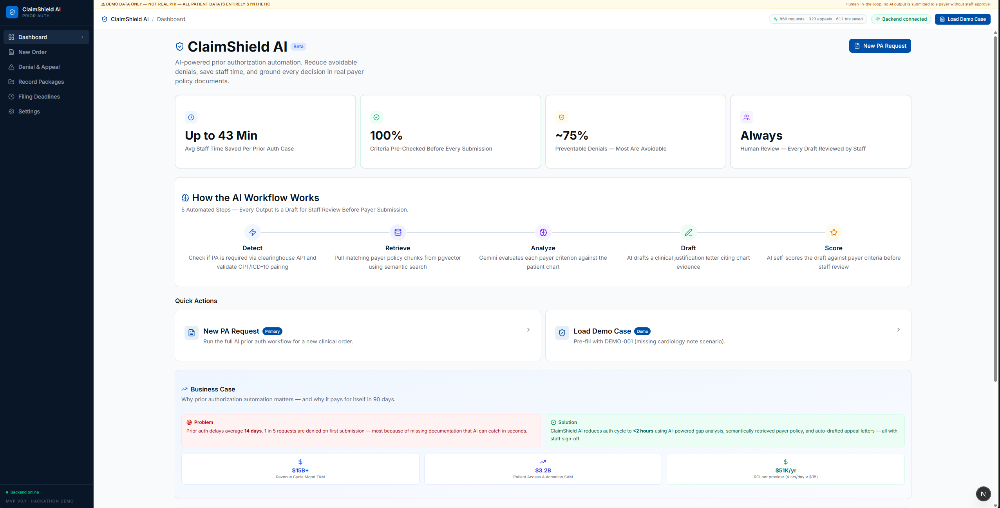

# ClaimShield AI


**AI-powered prior authorization and revenue cycle automation for U.S. healthcare providers.**

Prior auth delays average 14 days and cost providers **$35B/year**. ~75% of denials are preventable with correct documentation. ClaimShield AI automates the full PA workflow — from clinical order through denial appeal — with a 5-step AI pipeline and mandatory human review before every payer submission.

---

## Demo



### Demo Cases

| ID | Payer | Procedure | Scenario |
|----|-------|-----------|----------|
| **DEMO-001** | BCBS Texas PPO | CT Coronary Angiography — CPT 75571 | Missing cardiology note; gap flagged; appeal drafted |
| **DEMO-002** | Aetna PPO | Physical Therapy — CPT 97110 | Eligibility pre-check; criteria met; clean package assembled |
| **DEMO-003** | United Healthcare | Cardiac Rehabilitation — CPT 93798 | Denial received; Gemini auto-drafts appeal citing ACC/AHA 2021 |

---

## How It Works

| Step | What happens |
|------|-------------|
| **1 · Detect** | Checks clearinghouse (X12 271) for PA requirement; validates CPT/ICD-10 pairing; blocks mismatched code pairs |
| **2 · Retrieve** | Semantic search over payer policy corpus via pgvector; Redis caches results per payer/CPT for 24 h; keyword fallback |
| **3 · Analyze** | Gemini reads the patient's FHIR chart against retrieved policy criteria; outputs structured gap analysis |
| **4 · Draft** | Gemini writes a full clinical justification letter with guideline citations and medical necessity evidence |
| **5 · Score** | Gemini self-scores the draft per criterion (pass / flag / fail) and outputs an overall readiness percentage |

---

## Architecture

```
Next.js 16  ──SSE/HTTP──▶  FastAPI  ──▶  LangGraph State Machine
                                              │
                              ┌───────────────┼───────────────┐
                              ▼               ▼               ▼
                        Gemini LLM      pgvector RAG     Redis Cache
                     (analyze/draft/   (policy chunks,  (24h TTL per
                        score)          3072-dim embs)   payer+CPT)
                              │
                    ┌─────────┴─────────┐
                    ▼                   ▼
             Mock EHR API         Mock Clearinghouse
             (FHIR R4)            (X12 270/271)

Stack:  FastAPI 0.111 · Python 3.11 · LangGraph 0.1
        Next.js 16 · TypeScript · Tailwind CSS v4 · shadcn/ui
        PostgreSQL 15 + pgvector 0.8 · Redis 7 · Docker Compose
```

---

## Quick Start

**Prerequisites:** Python 3.11+, Node.js 18+, Docker Desktop, [Google AI API key](https://aistudio.google.com/app/apikey)

### Step 1 — Clone the repo

```bash
git clone <repo-url>
cd ClaimShieldAI
```

### Step 2 — Start infrastructure (Postgres + Redis)

```bash
docker compose up -d
```

Wait ~10 seconds. Postgres listens on `5432`, Redis on `6379`.

### Step 3 — Backend

```bash
cd backend

# Create and activate virtual environment
python -m venv .venv

# Windows
.venv\Scripts\activate

# macOS / Linux
source .venv/bin/activate

# Install dependencies
pip install -r requirements.txt
```

Copy and fill the environment file:

```bash
cp .env.example .env
```

Open `.env` and set at minimum:

```dotenv
GOOGLE_API_KEY=your_google_api_key_here
```

Seed the database (embeds 9 policy chunks via Gemini — takes ~2 min due to API rate limits):

```bash
python -m app.ingestion.seed --wipe
```

Start the API server:

```bash
uvicorn app.main:app --reload --host 127.0.0.1 --port 8000
```

Verify:

```bash
curl http://127.0.0.1:8000/api/v1/health
# → {"status":"ok","version":"0.1.0","environment":"development"}
```

### Step 4 — Frontend

Open a new terminal:

```bash
cd frontend
npm install
cp .env.example .env.local
npm run dev
```

### Step 5 — Open the app

Navigate to **http://localhost:3000** → click **New Order** → **Load Demo Case** → select **DEMO-001** → click **Submit for Prior Authorization**.

---

## Running the Demo

1. Click **New Order** → **Load Demo Case** → select **DEMO-001** (James Mitchell, BCBS Texas PPO)
2. Click **Submit for Prior Authorization** — watch the 5-step workflow animate live (~60–90 s)
3. When complete, review the results:
   - **Gap Analysis** — 2 criteria met (green), 1 missing (red): the cardiology consult note
   - **AI Self-Score** — ~67% readiness, amber "Needs Revision", pass/flag/fail per criterion
   - **Draft Letter** — ~400-word clinical justification, editable inline
4. Click **Approve and Package Records** — view submission checklist and chart artifacts
5. Click **Trigger Mock Denial** — Gemini auto-drafts an appeal letter with guideline citations

**Code mismatch detection:** Manually pair CPT `75571` with ICD-10 `J18.9` (pneumonia) and submit. A blocking modal fires during the Detect step — staff must confirm before the workflow continues.

---

## API Reference

Base URL: `http://127.0.0.1:8000/api/v1`

| Method | Endpoint | Description |
|--------|----------|-------------|
| `GET` | `/health` | Health check — status, version, environment |
| `POST` | `/process-order` | Run 5-step PA workflow; streams progress as SSE |
| `GET` | `/demo-cases` | List all demo cases |
| `GET` | `/demo-cases/{id}` | Get full detail for one case |
| `POST` | `/denial/appeal` | Generate Gemini-drafted appeal letter |
| `POST` | `/records/package` | Assemble payer-ready clinical record bundle |
| `GET` | `/retrieval-test` | Debug RAG — inspect policy chunks for a payer/CPT |
| `GET` | `/admin/status` | Live config: Redis, DB, LLM model |
| `POST` | `/admin/reseed` | Re-register in-memory mock data |
| `POST` | `/admin/clear-cache` | Flush Redis policy chunk cache |

---

## Project Structure

```
ClaimShieldAI/
├── backend/
│   ├── app/
│   │   ├── api/routes/       # FastAPI route handlers
│   │   ├── core/             # LangGraph workflow + config
│   │   ├── services/         # LLM, retrieval, cache, rules
│   │   ├── mocks/            # FHIR R4 EHR + X12 clearinghouse mocks
│   │   └── ingestion/        # pgvector seed script
│   ├── requirements.txt
│   └── .env.example
├── frontend/
│   ├── app/(dashboard)/      # Dashboard, New Order, Deadlines, Settings
│   ├── components/           # AppShell, shadcn/ui
│   └── lib/api.ts            # REST + SSE client
├── docker-compose.yml
└── docs/screenshot.png
```

---

## Team

**ClaimShield AI** — SpinSci Healthcare AI Hackathon 2026

*All patient data is synthetic. No real PHI is used or stored. This is a demonstration prototype, not a clinical tool.*
